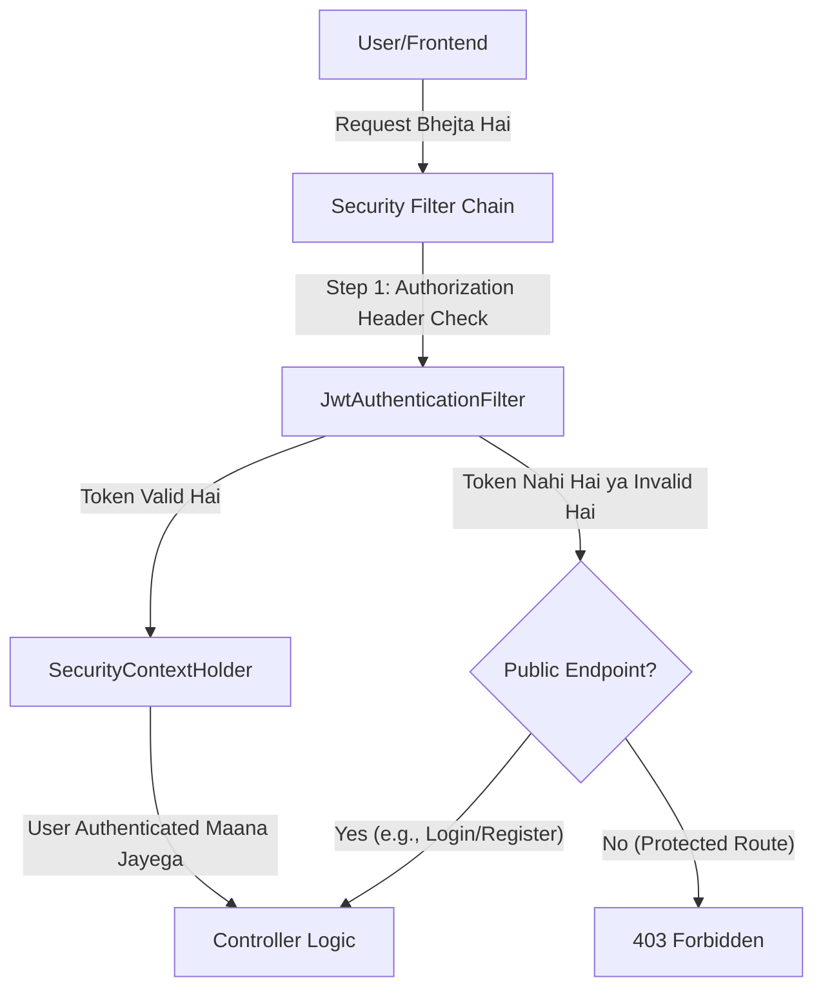
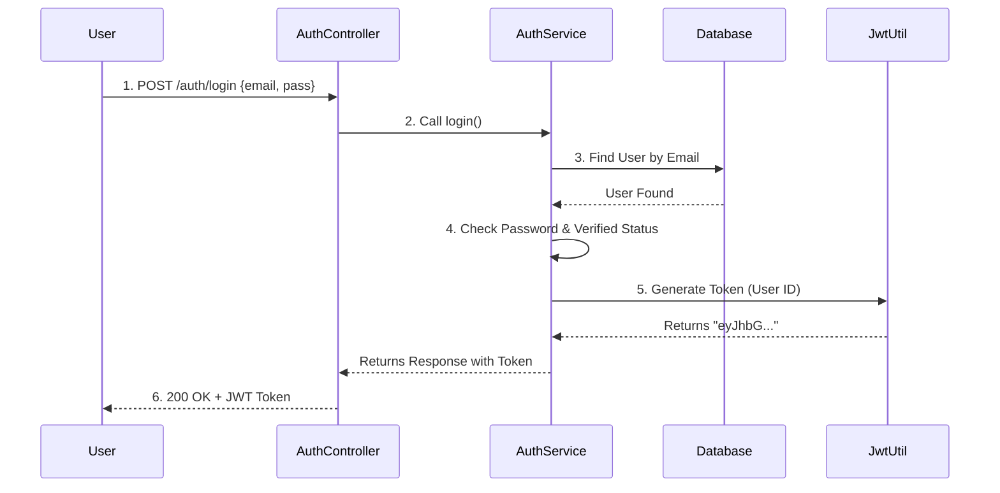
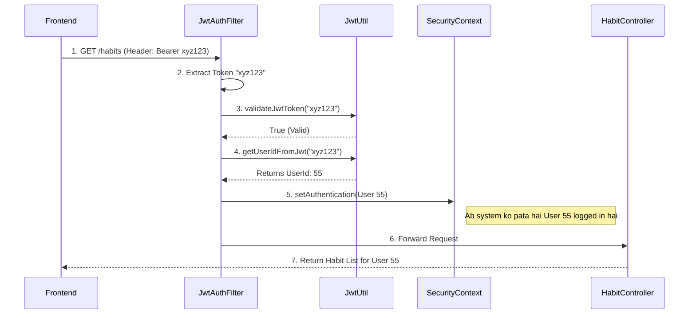

# Authentication & Security Implementation Guide (Hinglish Edition)

Hello Developer! 👋
Yeh document poori tarah se explain karega ki hamari application (`habit-hero` backend) mein **Authentication** kaise kaam karti hai. Humne **JWT (JSON Web Token)** based mechanism use kiya hai jo state-less aur secure hai.

---

## 🏗️ High-Level Overview (Mota-moti Samajhein)

Jab bhi koi request aati hai, hamara system usse check karta hai. Process kuch aisa dikhta hai:

### 🗝️ Key Components (Hamein kin cheezo ki zaroorat hai?)

Humne 5 main files use ki hain. Har file ka ek specific kaam hai:

| File Name | Role (Kirdar) | Kya karta hai? (Simple Bhasha mein) |
|-----------|---------------|-------------------------------------|
| **SecurityConfig.java** | **The Guard 👮‍♂️** | Gatekeeper hai. Decide karta hai kaun andar aayega, kaun bahar rahega. Kis URL pe password chahiye aur kaunsa khula hai. |
| **JwtAuthenticationFilter.java** | **ID Checker 🕵️‍♂️** | Har request ke saath aane wale "Token" (ID Card) ko check karta hai. Agar card asli hai, toh andar jaane deta hai. |
| **JwtUtil.java** | **Card Printer 🖨️** | Token banana (Generate) aur check karna (Validate) iska kaam hai. Yeh token ke andar user ka ID chhupa ke rakhta hai. |
| **AuthService.java** | **Manager 👨‍💼** | Registration, Login, OTP verification ka sara logic yahan likha hai. Database se baat yahi karta hai. |
| **AuthController.java** | **Receptionist 💁‍♀️** | Bahar ki duniya (Frontend) se request leta hai aur `AuthService` (Manager) tak pahunchata hai. |

---

## 📂 Detailed File Breakdown & Logic (Gherayi mein)

### 1. `SecurityConfig.java` - The Guard 👮‍♂️
**Path:** `src/main/java/com/habit/hero/config/SecurityConfig.java`

Yeh file Spring Security ko batati hai ki security kaise handle karni hai.

**Main Methods & Why:**
*   **`securityFilterChain(HttpSecurity http)`**:
    *   **CSRF Disable**: `csrf.disable()` karte hain kyunki hum JWT use kar rahe hain (Session nahi), toh CSRF attack ka risk kam hai.
    *   **CORS Config**: `cors(...)` set kiya hai taaki `localhost:5173` (Frontend) se requests accept ho sakein.
    *   **Permissions**: `authorizeHttpRequests` mein hum batate hain:
        *   `/auth/**` aur `/ws/**` -> **PermitAll** (Koi bhi aa sakta hai).
        *   Baaki sab (e.g., `/habits/**`) -> **Authenticated** (Token dikhana padega).
    *   **Stateless Session**: `SessionCreationPolicy.STATELESS` ka matlab hai server user ka session yaad nahi rakhega. Har request mein token chahiye.
    *   **Add Filter**: `addFilterBefore(jwtAuthenticationFilter, ...)` -> Hamara custom filter pehle chalega.

### 2. `JwtAuthenticationFilter.java` - The ID Checker 🕵️‍♂️
**Path:** `src/main/java/com/habit/hero/filter/JwtAuthenticationFilter.java`

Yeh sabse important file hai. Har request sabse pehle yahan se guzarti hai (agar public nahi hai toh).

**Flow (Logic):**
1.  **Request Aayi**: Header mein `Authorization` dhoondo.
2.  **Token Nikalo**: Agar Header `Bearer eyJhbG...` jaisa hai, toh `Bearer ` hata ke sirf token (`eyJhbG...`) nikalte hain.
3.  **Validate**: `jwtUtil` se poochte hain "Kya yeh token asli hai?".
4.  **Extract User**: Agar asli hai, toh token me se User ID nikalte hain.
5.  **Set Authentication**: Ek `UsernamePasswordAuthenticationToken` banake `SecurityContextHolder` mein daal dete hain.
    *   *Note:* Iske baad Spring Security maan leta hai ki "Haan, yeh banda verified hai" aur request ko Controller tak jaane deta hai.

### 3. `JwtUtil.java` - The Card Printer 🖨️
**Path:** `src/main/java/com/habit/hero/utils/JwtUtil.java`

Iska kaam sirf Token ke saath khelna hai.

**Main Methods:**
*   **`generateToken(User user)`**:
    *   User ka ID, Email, Username, aur Verified status leta hai.
    *   Secret Key se sign karta hai.
    *   Result: Ek lamba string (JWT) jo client ko diya jata hai.
*   **`validateJwtToken(String token)`**:
    *   Token ko Secret Key se verify karta hai. Agar modify hua ho ya expire ho gaya ho, toh `false` return karega.
*   **`getUserIdFromJwt(String token)`**:
    *   Token ko khol ke usme se chhupa hua User ID wapas nikalta hai.

### 4. `AuthServiceImpl.java` - The Manager 👨‍💼
**Path:** `src/main/java/com/habit/hero/service/impl/AuthServiceImpl.java`

Yahan business logic hai.

**Methods:**
*   **`register(RegisterRequest request)`**:
    *   Check karta hai email/username exist to nahi karte.
    *   User create karke DB mein save karta hai (Password ko `BCrypt` se encrypt karke).
    *   **OTP**: Ek random number generate karke user ko Email karta hai.
*   **`verifyOtp(VerifyOtpRequest request)`**:
    *   User ka OTP DB wale OTP se match karta hai.
    *   Sahi hone par `user.setVerified(true)` karta hai.
    *   **Inaam**: Phir `jwtUtil` se token banwa ke user ko de deta hai log in ke liye.
*   **`login(LoginRequest request)`**:
    *   Email se user dhoondta hai.
    *   Password match karta hai (`passwordEncoder.matches`).
    *   Check karta hai "Verified hai kya?".
    *   Sab sahi toh --> **Token Generate** karke return karta hai.

---

## 🔄 Practical Flows (Kaise kaam karta hai?)

### Flow 1: Jab User Login Karta Hai (Public Access)
Yeh request sidha Controller tak jati hai kyunki `SecurityConfig` mein `/auth/**` permitted hai.

### Flow 2: Jab User Data Mangta Hai (Protected Access)
Maan lo user `/habits` access karna chahta hai. Ab Filter beech mein aayega.

---

## 💡 Practical Example: Rohan ki Kahani

**Scenario:** Rohan ek naya user hai.

1.  **Registration:**
    *   Rohan details bharta hai.
    *   **Controller** request `AuthService` ko deta hai.
    *   `AuthService` Rohan ko save karta hai (`Verified = false`) aur OTP email karta hai.
    *   Abhi Rohan login nahi kar sakta.

2.  **OTP Verification:**
    *   Rohan email se OTP dekh ke website pe dalta hai.
    *   `AuthService` OTP match karta hai. Sahi hai?
    *   Rohan ka status `Verified = true` ho jata hai.
    *   Badle mein Rohan ko ek **JWT Token** milta hai. Rohan ka browser isse save kar leta hai.

3.  **Using the App (Creating a Habit):**
    *   Rohan "Gym" habit add karta hai.
    *   Request: `POST /habits`
    *   Header: `Authorization: Bearer <Rohan_Ka_Token>`
    *   **JWTFilter** dekhta hai: "Arre, token to sahi hai. Yeh User ID 1 (Rohan) hai."
    *   Request **HabitController** ke paas jati hai.
    *   HabitController bolta hai "Okay, User 1 ke liye Gym habit save kar do."

4.  **Bad Actor (Hacker):**
    *   Hacker `POST /habits` try karta hai bina token ke.
    *   **JWTFilter** dekhta hai: "Koi token nahi hai."
    *   Request aage badhti hai par `SecurityContext` khali hai.
    *   **SecurityConfig** ka guard rok leta hai: "Ruko! `/habits` ke liye authentication zaroori hai."
    *   Result: `403 Forbidden`.

---

## 🛠️ Summary Checklist
Agar aapko koi naya feature banana hai jo secure ho:
1.  **Controller** banao.
2.  **SecurityConfig** check karo (mostly `anyRequest().authenticated()` sab sambhal lega).
3.  Frontend se request bhejte waqt **Authorization Header** mat bhoolna.
