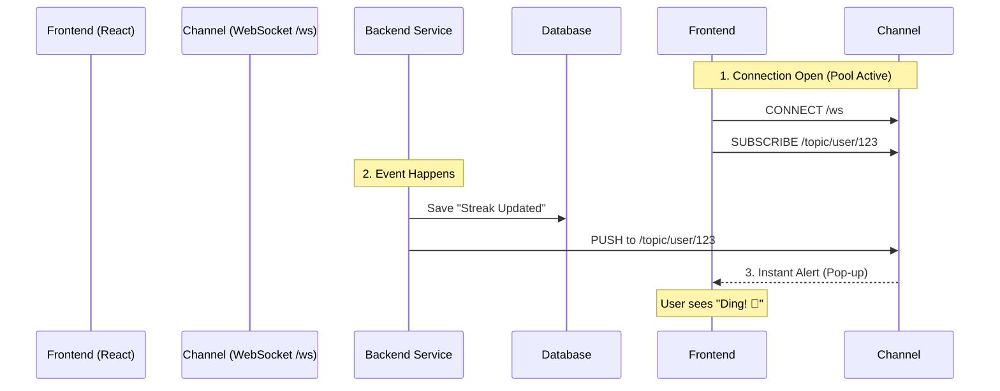

# Helper Guide: Habit, Log, and Notification Services 🚀

Hello Jay! 👋
Is file mein maine `Habit`, `HabitLog`, aur `Notification` ki service layer ko detail mein explain kiya hai. Hum samjhenge ki har file mein kaunse methods hain, wo kya kaam karte hain, aur humne unhe kyun use kiya hai.

---

## 1. HabitServiceImpl.java 📝
**Kyoon hai ye file?**
Ye service file `Habit` create, read, update, aur delete karne ka main logic sambhalti hai. Controller siraf request leta hai, lekin asli kaam (validations, DB interaction) yahan hota hai.

### Methods Explanation (Kya aur Kyun?)

#### 1. `createHabit(Long userId, HabitCreateRequest request)`
*   **Kya karta hai?** Naya habit banata hai.
*   **Kyun?** Jab user "Add Habit" form bharta hai, toh backend ko data save karna padta hai.
*   **Logic:**
    *   Pehle User ko dhundo (`findById`). Agar nahi mila toh error.
    *   Request data ko Entity mein convert karo (`HabitMapper`).
    *   **Special Check:** Agar habit `DAILY` hai, toh `SessionCount` ki zaroorat nahi hoti, use `null` set kar dete hain.
    *   DB mein save karte hain.

#### 2. `updateHabit(Long userId, Long habitId, HabitUpdateRequest request)`
*   **Kya karta hai?** Existing habit ko edit karta hai.
*   **Kyun?** Agar user typo theek karna chahe ya cadence change karna chahe.
*   **Logic:**
    *   Habit dhoondo jo ussi user ki ho (`findByIdAndUserId`). Security ke liye zaroori hai taaki koi aur edit na kar sake.
    *   Nayi values set karo aur save karo.

#### 3. `getHabit(Long userId, Long habitId)`
*   **Kya karta hai?** Ek single habit ki details laata hai.
*   **Kyun?** Jab user kisi specific habit pe click karta hai detail page kholne ke liye.
*   **Logic:** Simply DB se fetch karta hai aur DTO (Data Transfer Object) mein badal ke bhejta hai.

#### 4. `getAllHabits(Long userId)`
*   **Kya karta hai?** User ki saari habits laata hai.
*   **Kyun?** Dashboard pe list dikhane ke liye.
*   **Logic:** `findByUserId` use karke list nikalta hai aur sabko ek-ek karke response format mein convert karta hai.

#### 5. `deleteHabit(Long userId, Long habitId)`
*   **Kya karta hai?** Habit delete karta hai.
*   **Kyun?** User ko habit pasand nahi aayi ya galti se ban gayi.
*   **Logic:** Pehle verify karta hai ki habit user ki hi hai, phir uda deta hai.

#### 6. `bulkCreateHabits(Long userId, HabitBulkCreateRequest request)`
*   **Kya karta hai?** Ek saath 2-3 habits banata hai.
*   **Kyun?** Onboarding ke time shayad hum user se puchhein "Select 3 habits to start with" aur wo ek baar mein submit karein.
*   **Logic:** Loop chala ke sabko convert karta hai aur `saveAll` use karta hai performance ke liye.

### 📌 Summary: HabitServiceImpl
> Ye file user ki **Habits** manage karti hai. CRUD (Create, Read, Update, Delete) operations yahan hote hain. Sabse zaroori cheez ye hai ki har method mein hum **UserId** check karte hain taaki data secure rahe.

---

## 2. HabitLogServiceImpl.java ✅
**Kyoon hai ye file?**
Sabse complex logic yahan hai. Ye handle karta hai jab user habit ko "Mark Done" karta hai. Isme streak update karna, notification bhejna, aur duplicacy rokna shamil hai.

### Methods Explanation (Kya aur Kyun?)

#### 1. `createLog(Long userId, Long habitId, HabitLogCreateRequest request)`
*   **Kya karta hai?** Habit ko aaj ke liye complete mark karta hai.
*   **Kyun?** User ka progress track karne ke liye.
*   **Process (Flow):**
    *   **Validation:** User aur Habit exist karte hain?
    *   **Duplicate Check:** Kya user ne aaj already log kiya hai? Agar haan, toh error `Log already exists` feko.
    *   **Save:** Log DB mein save karo.
    *   **Notification:**
        *   User ko "Streak updated" ka notification bhejo.
        *   **Milestone Check:** Agar streak 7 ya 30 din ki ho gayi, toh "Congratulations" notification bhi bhejo.

#### 2. `getLogsForHabit(Long userId, Long habitId)`
*   **Kya karta hai?** Ek habit ki saari history nikalta hai.
*   **Kyun?** Calendar view ya stats graph dikhane ke liye.

#### 3. `deleteLog(Long userId, Long logId)`
*   **Kya karta hai?** Log entry delete karta hai (Undo functionality).
*   **Kyun?** Galti se "Mark Done" dab gaya ho.
*   **Special:** Log delete karne ke saath-saath usse juda hua notification bhi delete kar deta hai taaki user confuse na ho.

#### 4. `getLogsInRange(...)`
*   **Kya karta hai?** Sirf specific dates ke beech ke logs laata hai.
*   **Kyun?** "Last 7 Days" ya "This Month" ka data dikhane ke liye, poori history load karne ki jagah. Performance bachata hai.

#### 5. `getTodayStatus(Long userId)`
*   **Kya karta hai?** User ki saari habits check karta hai aur batata hai "Aaj kaunsi done hai aur kaunsi baki hai".
*   **Kyun?** Dashboard pe checkboxes ko tick/untick dikhane ke liye.
*   **Logic:** Har habit ke liye check karta hai ki aaj ka log exist karta hai ya nahi.

#### 6. `updateNote` / `getNote` / `deleteNote`
*   **Kya karta hai?** Log ke saath note (comment) add/edit karta hai.
*   **Kyun?** User likhna chahe "Aaj gym mein 5kg extra uthaya".

### 📌 Summary: HabitLogServiceImpl
> Ye file user ki **Progress** aur **Consistency** sambhalti hai. Jab bhi user tick ✅ karta hai, ye service active hoti hai. Ye duplicate entries rokti hai, milestones calculate karti hai, aur notifications trigger karti hai.

---

## 3. NotificationServiceImpl.java 🔔
**Kyoon hai ye file?**
Ye user ko update rakhne ke liye hai. Isme Real-time notifications (WebSocket) aur Database storage dono handle hote hain.

### Methods Explanation (Kya aur Kyun?)

#### 1. `createNotification(...)`
*   **Kya karta hai?** Notification banata hai, save karta hai, aur frontend pe bhejta hai.
*   **Kyun?** User ko batane ke liye ki kuch hua hai (e.g., Streak badhi, Friend Request aayi).
*   **Logic:**
    *   Check karo user ne notifications disable toh nahi kiye?
    *   DB mein save karo (`isRead = false`).
    *   **WebSocket:** `messagingTemplate.convertAndSend` use karke turant frontend pe popup dikhata hai bina page refresh kiye.

#### 2. `getUserNotifications(Long userId)`
*   **Kya karta hai?** User ke saare purane notifications laata hai.
*   **Kyun?** Notification bell icon pe click karne par list dikhane ke liye.

#### 3. `markAsRead` / `markAllAsRead`
*   **Kya karta hai?** Notification ko "Read" mark karta hai.
*   **Kyun?** Taaki red dot hat jaye aur user ko pata chale ki ye wo dekh chuka hai.

#### 4. `deleteNotificationByReference(...)`
*   **Kya karta hai?** Kisi event se jude notification ko delete karta hai.
*   **Kyun (Bahut Zaroori):**
    *   Agar maine Habit Log delete kiya (Undo kiya), toh "Streak Updated" wala notification bhi hatana padega na? Warna user bolega "Maine toh log delete kiya, par notification keh raha hai streak badh gayi".
    *   Ye method seedha SQL query (`deleteDirectly`) use karta hai safai ke liye.
    *   Frontend ko `REFRESH_COMMAND` bhejta hai taaki UI update ho jaye.

### 📌 Summary: NotificationServiceImpl
> Ye file **Alerts** manage karti hai. Iska kaam sirf DB mein save karna nahi, balki **WebSocket** ke through live user tak khabar pahunchana bhi hai. Ye smart cleanup bhi karti hai jab purani activities delete hoti hain.

---

## 🔔 Deep Dive: Notifications Kaise Kaam Karti Hain?

Notification system sirf ek file nahi hai, yeh ek poora **Flow** hai jo Backend se Frontend tak live connected rehta hai. Isse hum **Real-time Communication** kehte hain.

### 1. Kaun-kaun si files involve hain?

| File Name | Location | Role (Kirdaar) |
|-----------|----------|----------------|
| **WebSocketConfig.java** | `config/` | **The Tower**: Yeh server par ek tower khada karta hai (`/ws`) jahan sabhi users connect hote hain. |
| **NotificationController.java** | `controller/` | **The History Book**: Purani notifications dekhne ke liye normal API requests handle karta hai. |
| **NotificationServiceImpl.java** | `service/impl/` | **The Messenger**: Jab bhi kuch hota hai, yeh DB mein save karta hai AUR tower se user ko turant message bhejta hai. |
| **SimpMessagingTemplate** | (Built-in Spring) | **The Loudspeaker**: Yeh Spring ka tool hai jo specific 'Topic' par message broadcast karta hai. |

---

### 2. Connection Pool & Flow (Kya Magic Ho Raha Hai?)

Normal HTTP request mein kya hota hai? User request bhejta hai -> Server jawab deta hai -> Connection **Band**.
Lekin **WebSocket** mein connection **Khula Rehta Hai**.

#### Step-by-Step Flow:

1.  **Handshake (Connection Banana)** 🤝
    *   Frontend (`SockJS`) server ke paas aata hai: `"Hello, main connect hona chahta hoon at /ws"`.
    *   Server (`WebSocketConfig`) bolta hai: `"Permission granted (Access Token valid hai?) Ok, aaja."`
    *   **Connection Pool Logic:** Ab server ne apne paas note kar liya ki **Jay (User)** online hai. Ek pipe (socket) khul gaya hai jo band nahi hoga.

2.  **Subscription (Kaan Lagana)** 👂
    *   Frontend bolta hai: `"Main /topic/user/123 sununga. Agar mere liye kuch aaye toh batana."`
    *   Server ka Broker kehta hai: `"Ok, 123 waali line pe kuch bhi aayega toh seedha tujhe milega."`

3.  **Event Trigger (Bomb Futna)** 💥
    *   User ne Habit complete ki.
    *   `HabitLogService` chala -> usne `createLog` kiya.
    *   Wahi se call gaya `NotificationService.createNotification()`.

4.  **Push Mechanism (Deliver Karna)** 🚚
    *   `NotificationService` ne pehle DB mein save kiya (Backup ke liye).
    *   Phir usne `messagingTemplate` ko bola: `"/topic/user/123" pe ye message bhej do: 'Good Job!'`
    *   Kyunki connection **PEHLE SE KHULA THA**, message bijli ki raftaar se Frontend pahunch gaya bina page refresh kiye.

### 3. Conclusion: Connection Pool Kya Hai?
Yahan "Pool" ka matlab Database wala connection pool nahi hai. Yahan matlab hai **Active Sessions Registry**.
Spring Boot ke andar ek registry hoti hai jo yaad rakhti hai ki:
*   Socket ID `xj9-22a` = User `Jay`
*   Socket ID `bk2-11b` = User `Rahul`

Jab hum `template.convertAndSend` karte hain, toh Spring is registry me check karta hai ki Jay ka socket kaunsa hai aur ussi pipe mein data daal deta hai. Agar Jay offline hai, toh message WebSocket se nahi jayega (fail hoga silently), lekin DB mein saved rahega, toh jab Jay wapas aayega (`getUserNotifications`), use dikh jayega.

Isliye hum **Hybrid Approach** use karte hain:
*   **Live:** WebSocket (Maza aata hai, fast hai).
*   **Backup:** Database (Reliable hai, history rakhta hai).

Happy Coding! 🚀
