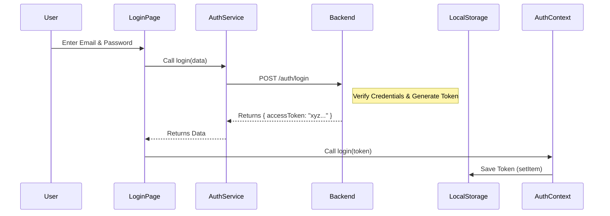

# Authentication Documentation 🔐

Is documentation mein hum samjhenge ki pure application mein Authentication kese kaam kar raha hai. Hum dekhenge ki kaunsi files involved hain, request ka flow kya hai, aur token kese manage ho raha hai.

## 📂 Files Involved & Their Roles (Kya aur Kyu?)

Niche di gayi files frontend aur backend (jaisa ki standard structure hota hai) mein authentication ko handle karti hain.

| Side | File Name | Location | Kya kaam karti hai? (What?) | Kyu use kar rahe hain? (Why?) |
|---|---|---|---|---|
| **Frontend** | `AuthContext.jsx` | `src/context/` | Pure app mein User ka state (login/logout) manage karti hai. | Taaki hume har page par baar-baar user data na mangna pade. Global access provide karta hai. |
| **Frontend** | `axiosConfig.js` | `src/api/` | Ye humara HTTP Client interceptor hai. | **Token Injection**: Har request ke sath automatically header mein Token attach karne ke liye (Interceptor ka use karke). |
| **Frontend** | `authService.js` | `src/services/` | Login, Register, OTP methods contain karta hai. | API calls ko clean rakhne ke liye aur logic ko components se alag rakhne ke liye. |
| **Frontend** | `LoginPage.jsx` | `src/pages/` | User se email/password leta hai aur login trigger karta hai. | UI provide karne ke liye jaha user credentials daal sake. |
| **Backend** | `JwtAuthenticationFilter`* | *(Backend)* | Incoming Request ka Token check karta hai. | Security Guard ki tarah hai, bina valid pass (token) ke kisi ko andar (Controller tak) nahi jaane deta. |
| **Backend** | `AuthController`* | *(Backend)* | Login/Signup requests receive karta hai. | Frontend se aayi request ko process karne aur Response (Token) bhejne ke liye. |

\* *Backend files current workspace mein visible nahi hain, par standard flow ke hisab se ye explain kiya gaya hai.*

---

## 🔄 Authentication Flow (Detailed Explanation)

Samajhte hain ki jab user button dabata hai toh piche kya hota hai.

### 1. Login Process (Token Kaise Milta Hai?)

1.  **User Action**: User `LoginPage` par Email/Password daalta hai aur "Sign In" click karta hai.
2.  **API Call**: `AuthService.login()` function execute hota hai jo Backend ko `POST /auth/login` request bhejta hai.
3.  **Backend Processing**:
    *   Backend check karta hai: Kya email exist karta hai? Kya password sahi hai?
    *   Agar **YES**: Backend ek **JWT Token** generate karta hai aur response mein bhejta hai.
    *   Agar **NO**: Error return karta hai ("Invalid Credentials").
4.  **Token Storage**:
    *   Frontend par `LoginPage` ko response milta hai.
    *   `AuthContext` ka `login()` function call hota hai.
    *   **Ye Token ko `localStorage` mein save karta hai.**
    *   Logic: `localStorage.setItem('token', newToken);`

**Diagram:**



---

### 2. Request Flow (Token Kaise Use Hota Hai?)

Ab jab user login ho chuka hai, toh agli har request ke sath token jana chahiye taaki backend pehchan sake ki ye kaun hai.

**Scenario**: User apna profile dekhna chahta hai (`/users/me`).

**Flow:**
1.  **Component Request**: Component `getMyProfileApi()` call karta hai.
2.  **Interceptor (`axiosConfig.js`)**:
    *   Request Network par jaane se pehle, `axiosInstance` ka **Internal Logic (Interceptor)** trigger hota hai.
    *   Ye `localStorage` se token nikalta hai.
    *   Header mein add karta hai: `Authorization: Bearer <your_token>`.
    *   **Kyu?**: Taaki backend ko pata chale ki ye request authenticated user se aayi hai.
3.  **Network Travel**: Request internet ke through Backend server tak pahunchti hai.
4.  **Backend Gatekeeper (Filter)**:
    *   Request sabse pehle **Security Filter** (e.g., `JwtAuthenticationFilter`) par aati hai. (Controller par jaane se pehle).
    *   Filter dekhta hai: "Kya iske pass Header mein Token hai?"
    *   Filter Token ko verify karta hai (Signature check, Expiry check).
5.  **Access Given (Controller)**:
    *   **If Valid**: Filter request ko aage jaane deta hai -> **Controller** -> **Service** -> **Database**.
    *   **If Invalid**: Filter wahi se `401 Unauthorized` return kar deta hai (Controller tak baat pahunchti hi nahi).

**Request Flow Diagram:**

```mermaid
flowchart TD
    A[Frontend Request] --> B{Axios Interceptor}
    B -- Adds Token --> C[Backend Server]
    
    subgraph Backend
    C --> D{Jwt Filter}
    D -- Token Missing/Invalid --> E[401 Unauthorized Response]
    D -- Token Valid --> F[Controller (Endpoints)]
    F --> G[Service Logic]
    end
    
    G --> H[Database]
    H --> G
    G --> F
    F --> A
```

---

## 🧐 Practical Understanding & Key Concepts

### 1. Token Kaha Save Hai?
Token browser ke **LocalStorage** mein save hota hai.
*   **Kyu?**: Taaki agar user page refresh kare, toh wo logout na ho jaye. `AuthContext` load hote hi localStorage check karta hai.
*   **Security Note**: LocalStorage XSS attacks se vulnerable ho sakta hai, par ye standard practice hai SPA (Single Page Apps) ke liye. Alternative `HttpOnly Cookies` hote hain.

### 2. "Request -> Filter -> Controller" Chain ka matlab?
Imagine karo ek **Office Building** (Backend).
*   **Gatekeeper (Filter)**: Building ke gate par Security Guard khada hai.
*   **ID Card (Token)**: Aapka access card.
*   **Manager (Controller)**: Wo banda jisse aapko milna hai.

Jab aap building mein enter karte ho:
1.  Frontend (Aap) gate par jaate ho.
2.  **Filter (Guard)** pehle ID Card (Token) check karta hai.
    *   Agar ID Card nahi hai ya expired hai -> "Bahar jao" (401 Error).
    *   Agar ID Card valid hai -> "Andar jao" (Request passed to Controller).
3.  Fir aap **Controller (Manager)** ke pass pahunchte ho apna kaam (Data fetch) karne ke liye.

Agar Filter nahi hota, toh koi bhi (bina login kiye) seedha Manager ke cabin mein ghus jata! Isliye Filter sabse pehle aata hai.

### 3. Axios Interceptor Kyu?
Socho agar hume har API call (Example: Get Habits, Get Profile, Get Friends) mein manually token add karna padta:
```javascript
// Aisa karna padta har jagah (Not Recommended)
axios.get('/habits', { headers: { Authorization: token } })
axios.get('/profile', { headers: { Authorization: token } })
```
Ye code repeat hota aur manage karna mushkil hota.
**Solution**: `axiosConfig.js` mein Interceptor laga diya. Ab bas `axiosInstance.get('/habits')` likho, token apne aap "Packet" mein chipak kar jayega.

---

## 🛠 Practical Example Code Snippet

**Frontend Interceptor Logic (`axiosConfig.js`):**
```javascript
// Har request ke start hone par ye function chalega
axiosInstance.interceptors.request.use(
    (config) => {
        // 1. Token nikalo
        const token = localStorage.getItem("token");
        
        // 2. Agar token hai, toh header mein daal do
        if (token) {
            config.headers.Authorization = `Bearer ${token}`; 
        }
        return config; // 3. Request ko jaane do
    }
);
```

**What is "Bearer"?**
Bearer ka matlab hai "Jo is token ko carry kar raha hai". Ye ek standard scheme hai headers mein token bhejne ke liye.

---
Umeed hai isse aapko pura Authentication flow clear ho gaya hoga! 🚀
